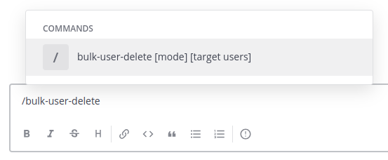
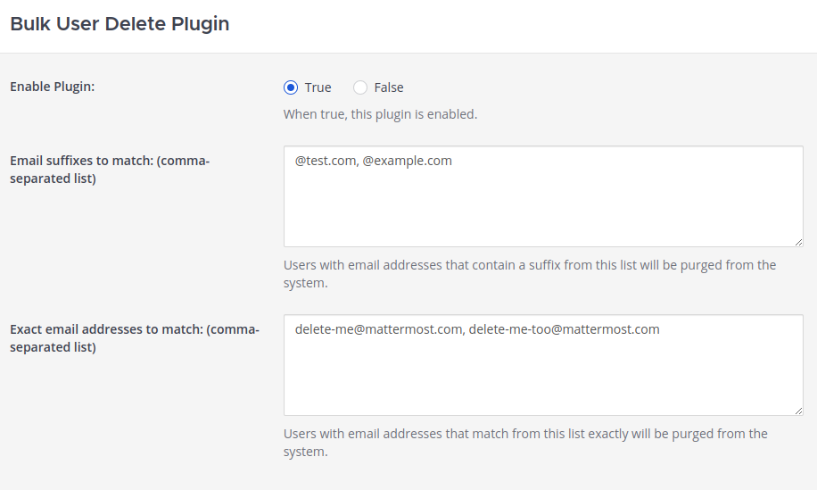
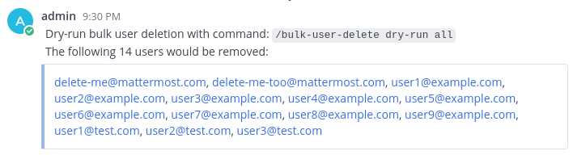
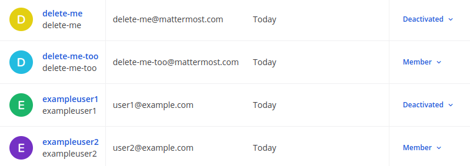
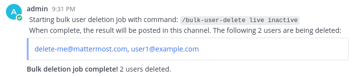

# Bulk User Delete Plugin

This plugin can be used to permanently remove users from a running Mattermost instance.

It introduces a new slash command, `/bulk-user-delete` to start the removal:



The removal is configured in the plugin settings. Only users with email addresses that match these filters will be removed by the slash command:



Before actually permanently removing users, you can run the command in dry-run mode to see what will get removed:



The slash command can be used to remove all users that match the specified email address filters. Alternatively, it can be used to only remove inactive users. If we deactivate a few users:



We can now remove only those users with the slash command:



## Configuration

This plugin requires local mode to be enabled to delete users. You'll need the following set in your Mattermost configuration to enable that:

```
"EnableLocalMode": false,
"LocalModeSocketLocation": "/var/tmp/mattermost_local.socket",
```

Additionally, to delete users over the API, the following must also be set in your Mattermost configuration:

```
"EnableAPIUserDeletion": true,
```

## Limitations

This plugin does not currently remove user data for most external plugins. Right now, only data created with the popular [boards](https://github.com/mattermost/mattermost-plugin-boards) and [playbooks](https://github.com/mattermost/mattermost-plugin-playbooks) plugins will have user data removed.

Additionally, the SQL queries used in this plugin to remove data are not optimized for performance, but instead for simplicity. The hope is that simpler queries are easier to understand and less likely to have errors.

Finally, this plugin only supports postgresql backends.
